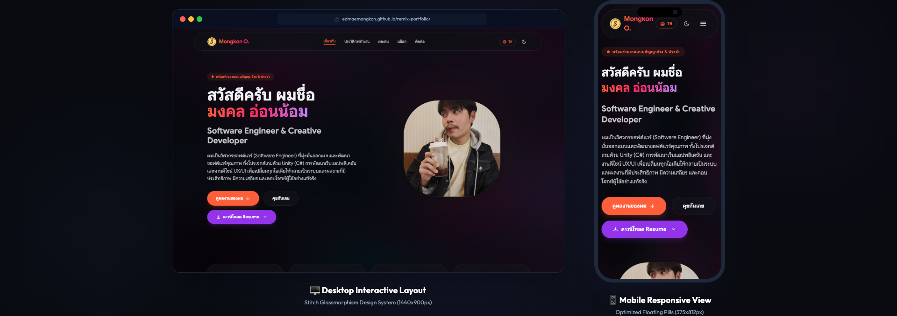
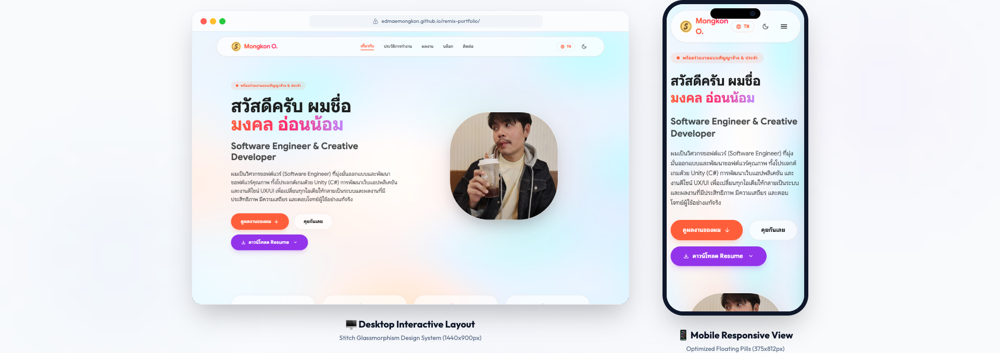
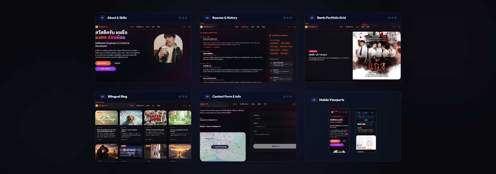
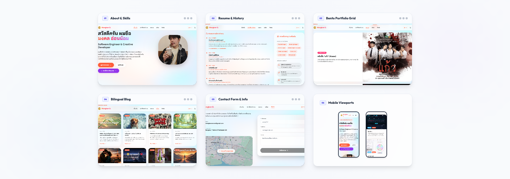

# 🌐 Premium Interactive Portfolio - Mongkon Onnom (S)

[](https://edmaemongkon.github.io/remix-portfolio/)
[](https://edmaemongkon.github.io/remix-portfolio/)
[](https://opensource.org/licenses/MIT)

ยินดีต้อนรับสู่โปรเจกต์พอร์ตโฟลิโอส่วนตัวเวอร์ชันพรีเมียมของ **มงคล อ่อนน้อม (เอส)** ในบทบาท **Software Engineer & Creative Developer** หน้าเว็บนี้ได้รับการออกแบบและพัฒนาด้วยสถาปัตยกรรมสไตล์ **Glassmorphism (กระจกโปร่งแสง)** สะอาดตา ทันสมัย และขับเคลื่อนด้วยระบบแอนิเมชันระดับแนวหน้าเพื่อมอบประสบการณ์การใช้งานที่ราบรื่นที่สุด

---

## 🔗 ลิงก์เข้าใช้งานหน้าเว็บจริง (Live Website)
เข้าชมพอร์ตโฟลิโอที่อัปเดตและแสดงผลแบบตอบโต้ (Interactive) ได้ที่:  
👉 **[https://edmaemongkon.github.io/remix-portfolio/](https://edmaemongkon.github.io/remix-portfolio/)**

---

## 📸 Interface Showcase (หน้าตาพอร์ตโฟลิโอ)

### 🖥️📱 Devices Mockups (ม็อคอัพอุปกรณ์คอมพิวเตอร์และมือถือ)

<table border="0" width="100%">
  <tr>
    <td align="center">
      
      <br><b>🌌 PC & Mobile Mockup (Dark Mode)</b>
    </td>
  </tr>
  <tr>
    <td align="center">
      
      <br><b>☀️ PC & Mobile Mockup (Light Mode)</b>
    </td>
  </tr>
</table>

### 🗂️ Section-by-Section Overview (ภาพรวมทีละส่วนการใช้งาน)

<table border="0" width="100%">
  <tr>
    <td align="center">
      
      <br><b>🌌 ทุกส่วนอินเตอร์เฟสในตารางเดียว (Dark Mode)</b>
    </td>
  </tr>
  <tr>
    <td align="center">
      
      <br><b>☀️ ทุกส่วนอินเตอร์เฟสในตารางเดียว (Light Mode)</b>
    </td>
  </tr>
</table>

### 🔍 Full-Length Pages (ลิงก์ภาพแคปหน้าจอเต็มหน้าเว็บเลื่อนลง)

หากต้องการดาวน์โหลดหรือดูรูปภาพขนาดเต็มของพอร์ตโฟลิโอในแบบยาว (Full-page Scrolling) สามารถคลิกลิงก์ด้านล่างนี้ได้เลยครับ:

| รูปแบบอุปกรณ์ / หน้าจอ | 🌌 โหมดมืด (Dark Mode) | ☀️ โหมดสว่าง (Light Mode) |
| :--- | :---: | :---: |
| **🖥️ คอมพิวเตอร์เดสก์ท็อป (PC Scroll)** | **[ดูรูปเต็มหน้าจอ](assets/screenshots/portfolio-pc-dark-full.png)** | **[ดูรูปเต็มหน้าจอ](assets/screenshots/portfolio-pc-light-full.png)** |
| **📱 โทรศัพท์มือถือ (Mobile Scroll)** | **[ดูรูปเต็มหน้าจอ](assets/screenshots/portfolio-mobile-dark-full.png)** | **[ดูรูปเต็มหน้าจอ](assets/screenshots/portfolio-mobile-light-full.png)** |

<details>
<summary><b>📂 คลิกเพื่อดูรูปภาพทีละส่วนแยกแต่ละหมวดหมู่ (About, Resume, Portfolio, Blog, Contact)</b></summary>

#### 🌌 โหมดมืด (Dark Mode)

- **01. เกี่ยวกับผม (About Section)**: [🖥️ เดสก์ท็อป](assets/screenshots/about-pc-dark.png) | [📱 มือถือ](assets/screenshots/about-mobile-dark.png)
- **02. ประวัติและทักษะ (Resume Section)**: [🖥️ เดสก์ท็อป](assets/screenshots/resume-pc-dark.png) | [📱 มือถือ](assets/screenshots/resume-mobile-dark.png)
- **03. ตารางผลงาน (Portfolio Bento Grid)**: [🖥️ เดสก์ท็อป](assets/screenshots/portfolio-pc-dark.png) | [📱 มือถือ](assets/screenshots/portfolio-mobile-dark.png)
- **04. บล็อกบทความ (Blog Section)**: [🖥️ เดสก์ท็อป](assets/screenshots/blog-pc-dark.png) | [📱 มือถือ](assets/screenshots/blog-mobile-dark.png)
- **05. ฟอร์มติดต่อ (Contact Section)**: [🖥️ เดสก์ท็อป](assets/screenshots/contact-pc-dark.png) | [📱 มือถือ](assets/screenshots/contact-mobile-dark.png)

#### ☀️ โหมดสว่าง (Light Mode)

- **01. เกี่ยวกับผม (About Section)**: [🖥️ เดสก์ท็อป](assets/screenshots/about-pc-light.png) | [📱 มือถือ](assets/screenshots/about-mobile-light.png)
- **02. ประวัติและทักษะ (Resume Section)**: [🖥️ เดสก์ท็อป](assets/screenshots/resume-pc-light.png) | [📱 มือถือ](assets/screenshots/resume-mobile-light.png)
- **03. ตารางผลงาน (Portfolio Bento Grid)**: [🖥️ เดสก์ท็อป](assets/screenshots/portfolio-pc-light.png) | [📱 มือถือ](assets/screenshots/portfolio-mobile-light.png)
- **04. บล็อกบทความ (Blog Section)**: [🖥️ เดสก์ท็อป](assets/screenshots/blog-pc-light.png) | [📱 มือถือ](assets/screenshots/blog-mobile-light.png)
- **05. ฟอร์มติดต่อ (Contact Section)**: [🖥️ เดสก์ท็อป](assets/screenshots/contact-pc-light.png) | [📱 มือถือ](assets/screenshots/contact-mobile-light.png)

</details>

---

## 📸 คุณสมบัติเด่นและเทคโนโลยี (Core Features)

- 🎨 **WebGL Color-Shifting Canvas Shader:** ระบบพื้นหลังแบบ Dynamic Shader ที่วาดขึ้นแบบเรียลไทม์ด้วย WebGL ชิฟต์เฉดสีและรูปทรงตอบสนองตามการเคลื่อนที่ของเมาส์ และเปลี่ยนโทนสีอัตโนมัติตามโหมดสว่าง/มืด (Light/Dark Mode Toggles)
- 💎 **Modern Glassmorphic UI Aesthetics:** อ้างอิงสไตล์การออกแบบระดับพรีเมียมจาก Stitch (Horizon Airy Tech) ใช้การเบลอหลังวัตถุแบบคมชัดสูง (Backdrop Blur 20px-24px), เส้นขอบโปร่งแสง 1px และสีสันแนว HSL Tailored
- ⚡ **Intersection Observer Tickers (แอนิเมชันตัวเลขวิ่ง):** ระบบนับตัวเลขความสำเร็จ (Key Stats) ค่อยๆ วิ่งจาก 0 ไปยังค่าเป้าหมายเมื่อเลื่อนหน้าจอมาถึง โดยใช้ `requestAnimationFrame` ควบคู่กับสูตร **Ease-Out Quadratic** เพื่อการวิ่งที่ลื่นไหลระดับ 60fps+
- 📱 **Mobile-First Responsive Layouts & Toggles:** ออกแบบแถบนำทาง (Floating Nav Pill) และปุ่มสไลด์เมนูมือถือ (Hamburger menu) พร้อมตรรกะแบบสลับเปิด-ปิดตามมาตรฐาน UX
- ↔️ **Filter Scroll Nav Arrows (ปุ่มลูกศรควบคุมหมวดหมู่):** ระบบตรวจจับขนาดหน้าจอมือถืออัตโนมัติ หากแถบเมนูหมวดหมู่ของผลงานมีความยาวล้นหน้าจอ (Overflow) ปุ่มลูกศรซ้าย-ขวาแบบไดนามิกจะปรากฏขึ้นเพื่อช่วยนำทาง พร้อมซ่อนแถบเลื่อนปกติด้วย CSS `.scrollbar-hide`
- 🌐 **Full Bilingual Support (TH/EN):** รองรับการสลับภาษาแบบทันทีระหว่างภาษาไทยและภาษาอังกฤษครอบคลุมทั้งหน้าเว็บโดยไม่ต้องโหลดหน้าใหม่

---

## 📂 รายละเอียดผลงานเด่นในพอร์ตโฟลิโอ (Featured Projects)

ในหน้าเว็บนี้รวบรวมชิ้นงานสร้างสรรค์ทั้งด้าน **วิศวกรรมซอฟต์แวร์ เกม ดีไซน์ และสื่อวิดีโอ** ไว้อย่างเป็นสัดส่วนบนตาราง Bento Grid:

| ชิ้นงาน / โปรเจกต์ | หมวดหมู่ | ลิงก์ผลงาน & รายละเอียด |
| :--- | :---: | :--- |
| **Kaew (แก้ว) - Short Film** | `Academic Project` | **[รับชมภาพยนตร์สั้น](https://youtu.be/JR6FwQcsMPc)**<br>"แก้วที่แตกมิอาจหวนคืนด้วยคำ 'ขอโทษ' เพราะมันจะคอยจองเวรทุกคน... จนกว่าจะตาย" โปรเจ็กต์หนังสั้นสร้างสรรค์สำหรับหลักสูตร DMS รุ่น 1 |
| **TikTok Return Barcode Scanner** | `Web App` | **[ลองใช้งานจริง](https://tiktok-return-scanner.vercel.app)**<br>ระบบจัดการสินค้าส่งคืน TikTok Shop สแกนรวดเร็วใน 0.5s บันทึกข้อมูลเข้า Google Sheets ป้องกันข้อมูลซ้ำซ้อน และแสดงผลสถิติหลังบ้านแบบเรียลไทม์บน Dashboard |
| **TypeZen (Typing Trainer)** | `Web App` | **[ลองใช้งานจริง](https://edmaemongkon.github.io/typing-practice/)**<br>เว็บฝึกพิมพ์สัมผัสสองภาษา ดีไซน์ Glassmorphism สุดหรู สังเคราะห์เสียงคีย์บอร์ดสะกดอารมณ์ และวิเคราะห์ผลเชิงลึก |
| **Lumina Spin (Lucky Wheel)** | `Web App` | **[ลองใช้งานจริง](https://edmaemongkon.github.io/Lumina-Spin/)**<br>วงล้อสุ่มรางวัลพรีเมียม ขับเคลื่อนด้วยอัลกอริทึมฟิสิกส์แรงหมุนจริง สังเคราะห์เสียงเรียลไทม์ และพลุกระดาษฉลอง |
| **Lumina Residences** | `Web App` | **[ลองใช้งานจริง](https://edmaemongkon.github.io/Lumina-Residences---Luxury-Beachfront-Condo/)**<br>พอร์ทัลข้อมูลอสังหาฯ หรู คัดกรองข้อมูล ค้นหา และคำนวณดอกเบี้ยสินเชื่อผ่อนบ้านเรียลไทม์ |
| **ภู่แก้วโภชนา (Banquet Website)** | `Web App` | **[ลองใช้งานจริง](https://edmaemongkon.github.io/phukaew-pochana/)**<br>เว็บแนะนำและจองโต๊ะจีนจัดเลี้ยงออนไลน์ 3 ภาษา คำนวณราคาเรียลไทม์ และระบบจองส่งตรงเข้าอีเมลทันที |
| **Black Cafe & Restaurant** | `Web App` | **[ลองใช้งานจริง](https://edmaemongkon.github.io/Black-Cafe-Restaurant/)**<br>เว็บแอปสำหรับคาเฟ่ สไตล์กระจกฝ้าหรูหรา เมล็ดกาแฟ 3D ลอยสลับภาษาอัตโนมัติ TH/EN |
| **Black Fitness** | `Web App` | **[ลองใช้งานจริง](https://edmaemongkon.github.io/Black-Fitness/)**<br>เว็บคลับฟิตเนสพรีเมียม ระบบแบ่งหน้าจอฮีโร่ตอบโต้ตามการเลื่อนเมาส์ และอุปกรณ์ฟิตเนสลอยหลัง |
| **Lace Shirt Catalog Design** | `Photography` | **[เปิดแฟ้มสะสมผลงาน Google Drive](https://drive.google.com/drive/folders/1o_Axhd0typGca3HF162_AbX4JlNTMSEZ?usp=sharing)**<br>การถ่ายภาพแฟชั่นชุดไทยมงคลร่วมสมัยและออกแบบแค็ตตาล็อกสินค้าสินค้าแบรนด์ ALMINI |
| **Shoe Catalog Studio Photography** | `Photography` | **[รูปเล่มจัดหน้า](https://drive.google.com/file/d/1FDE18VSKD8TkMfIGsHlgrFU05XgSKlfP/view?usp=drive_link)**<br>ผลงานถ่ายภาพสตูดิโอรองเท้าแฟชั่นสตรีท ควบคุมแสงสี และออกแบบแค็ตตาล็อกสินค้าเพื่อการพาณิชย์ |
| **2D Game (Platformer & UI)** | `Academic Project` | เกม 2D Platformer ที่พัฒนาด้วย Unity ประกอบด้วยระบบควบคุมการเคลื่อนที่, ฟิสิกส์การชน/กระโดด, เก็บไอเทม และหน้าหลัก UI Start Menu ตั้งค่าเสียงด้วย C# |
| **Blender 3D - Grass Cube** | `Academic Project` | งานจำลองสนามหญ้าในรูปแบบทรงลูกบาศก์สุดน่ารัก ปรับแต่งระบบแฮร์พาร์ติเคิล (Hair Particles) และจัดแสงสตูดิโอ |
| **Blender 3D - Stormy Ocean** | `Academic Project` | การคำนวณและประมวลผลฟิสิกส์คลื่นสะท้อนช่วงที่พายุเข้าในมหาสมุทรแบบ 3D ใน Blender |
| **Blender 3D - Isometric Workspace** | `Academic Project` | งานดีไซน์ฉาก Low-poly 3D Isometric จำลองพื้นที่ทำงานขนาดจิ๋วสุดน่ารักและเน้นการจัดวางแสงเงา |
| **8 Inspirational Blog Video Series** | `Blog` | **[ติดตามบน YouTube](https://www.youtube.com/@aoiklaew)**<br>วิดีโอ vlog สั้น 8 ตอนเพื่อเติมไฟชีวิตและมอบแรงบันดาลใจให้แก่ผู้ชม |

---

## 🛠️ เทคโนโลยีที่ใช้พัฒนาพอร์ต (Tech Stack)

- **โครงสร้างพื้นฐาน (Core):** HTML5, Vanilla JavaScript (ES6+), CSS3
- **การจัดแต่งสไตล์ (Styling):** Tailwind CSS (Browser Runtime Config)
- **กราฟิกและลูกเล่น (Graphics):** WebGL Fragment Shaders + CSS Canvas Render
- **ไอคอน (Icons):** Google Material Symbols (Rounded & Outlined)

---

## 🚀 การติดตั้งและรันโปรเจกต์บนเครื่องตนเอง (Local Installation)

คุณสามารถเปิดพอร์ตโฟลิโอนี้ขึ้นมาทดสอบบนเครื่องตนเองได้ง่ายๆ ไม่จำเป็นต้องใช้อินเทอร์เน็ตในการประมวลผลเซิร์ฟเวอร์:

1. **โคลนโปรเจกต์ลงเครื่อง:**
   ```bash
   git clone https://github.com/EdmaeMongkon/remix-portfolio.git
   ```
2. **เปิดไฟล์หน้าเว็บหลัก:**
   - ดับเบิลคลิกเปิดไฟล์ `index.html` บนเบราว์เซอร์ของคุณได้ทันที หรือรันผ่าน Live Server บน IDE (VS Code) เพื่อดูเฉดสี Shader และแอนิเมชันทั้งหมดแบบลื่นไหล

---

## 📬 ข้อมูลการติดต่อ (Contact & Platforms)

* **Email:** [mongkononnom@gmail.com](mailto:mongkononnom@gmail.com)
* **Phone:** [080-084-4424](tel:0800844424)
* **GitHub:** [@EdmaeMongkon](https://github.com/EdmaeMongkon)
* **YouTube:** [@aoiklaew](https://www.youtube.com/@aoiklaew)
* **TikTok:** [@aoiklaew](https://www.tiktok.com/@aoiklaew)
* **Facebook Page:** [Aoi Klaew](https://www.facebook.com/aoiklaew/)

---
**Developed with ❤️ by Mongkon Onnom (S)**  
*Engineered to bridge code, system design, and creative aesthetics.*
